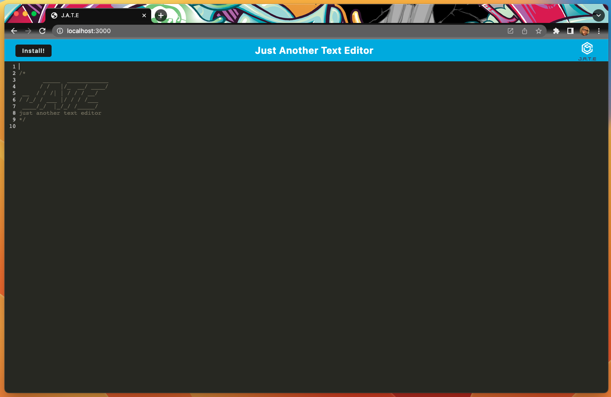
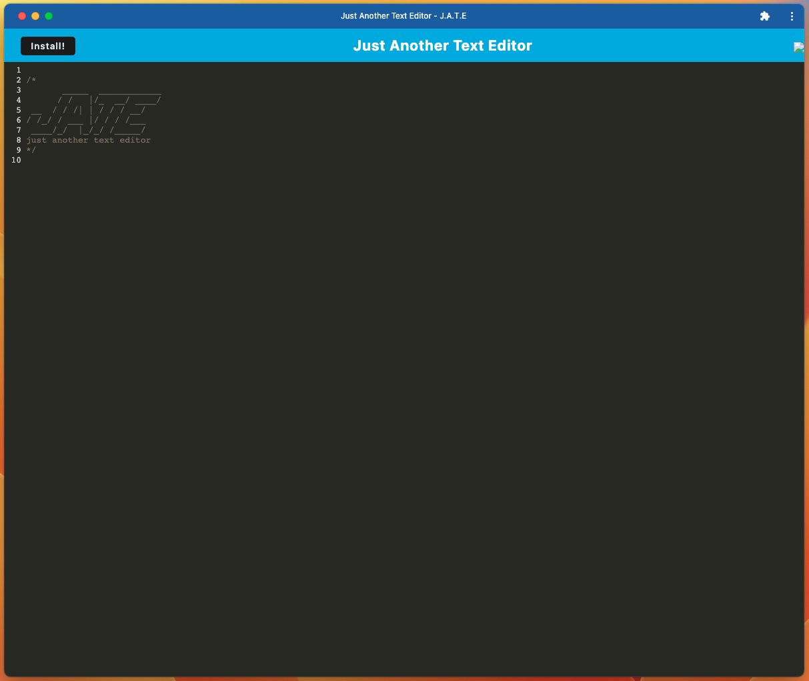

# my-J.A.T.E.
PWA 

## Description
A Progressive Web Application (PWA) using Client and Server structure to provide a text editor for use on the web and used if installed locally.

## Installation
Clone repository, run `npm start`, navigate to local host on Crhome browser, select option to __"Install"__ (optional).

## Usage
J.A.T.E. is literally Just Another Text Editor for you to write down what is most important to you.

## Screenshot

## License

Licensed under the MIT license.

Copyright © YankeeKnight. All rights reserved.